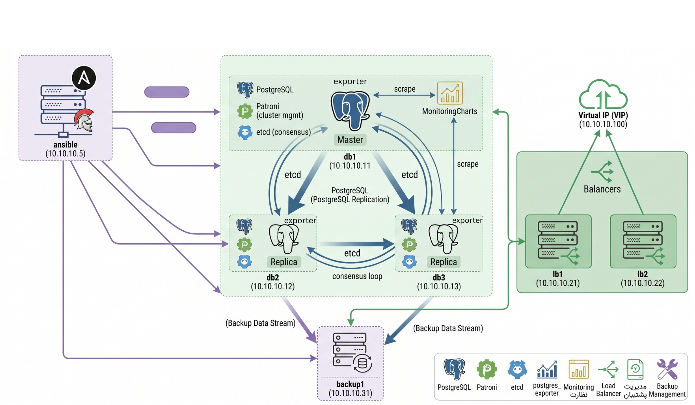

## Cluster Architecture



# Infrastructure Overview

## Node Roles

| Node | IP Address | vCPU | RAM (MB) | Role(s) |
|---|---|---:|---:|---|
| `ansible` | `10.10.10.5` | 1 | 1024 | Ansible controller |
| `db1` | `10.10.10.11` | 1 | 2048 | PostgreSQL, Patroni, etcd, postgres_exporter, Monitoring (Prometheus/Grafana) |
| `db2` | `10.10.10.12` | 1 | 2048 | PostgreSQL, Patroni, etcd, postgres_exporter |
| `db3` | `10.10.10.13` | 1 | 2048 | PostgreSQL, Patroni, etcd, postgres_exporter |
| `lb1` | `10.10.10.21` | 1 | 500 | Load balancer, Keepalived (VIP master/backup) |
| `lb2` | `10.10.10.22` | 1 | 500 | Load balancer, Keepalived (VIP master/backup) |
| `backup1` | `10.10.10.31` | 1 | 500 | Backup server (`pgbackrest` + WAL archiving) |
| **VIP** | **`10.10.10.100`** | — | — | Virtual IP for PostgreSQL access; managed by Keepalived on `lb1`/`lb2` |

## Inventory Group Mapping

| Group | Hosts | Purpose |
|---|---|---|
| `postgres` | `db1`, `db2`, `db3` | PostgreSQL / Patroni cluster |
| `etcd` | `db1`, `db2`, `db3` | etcd cluster for Patroni DCS |
| `loadbalancers` | `lb1`, `lb2` | Database traffic load balancing |
| `monitoring` | `db1` | Prometheus + Grafana monitoring stack |
| `backup` | `backup1` | Database backup and WAL archiving |

## How to deploy and use the project

All deployment and configuration tasks are executed from the **Ansible node**.

### 1. Start the Vagrant environment

From the project root, start the virtual machines:

```bash
vagrant up
```

After the machines are running, access the Ansible node:

```bash
vagrant ssh ansible
```

Move to the Ansible project directory:

```bash
cd /vagrant/ansible
```

---

### 2. Install Ansible on the Ansible node

Install Ansible on the Ansible node:

```bash
sudo apt update
sudo apt install -y ansible
```

Verify the installation:

```bash
ansible --version
```
---

### 3. Prepare Vagrant SSH keys

Vagrant generates a separate private SSH key for each machine.

Create a dedicated directory for the keys:

```bash
mkdir -p ~/.ssh/vagrant-keys
chmod 700 ~/.ssh/vagrant-keys

cp /vagrant/.vagrant/machines/db1/virtualbox/private_key ~/.ssh/vagrant-keys/db1
cp /vagrant/.vagrant/machines/db2/virtualbox/private_key ~/.ssh/vagrant-keys/db2
cp /vagrant/.vagrant/machines/db3/virtualbox/private_key ~/.ssh/vagrant-keys/db3
cp /vagrant/.vagrant/machines/lb1/virtualbox/private_key ~/.ssh/vagrant-keys/lb1
cp /vagrant/.vagrant/machines/lb2/virtualbox/private_key ~/.ssh/vagrant-keys/lb2
cp /vagrant/.vagrant/machines/backup1/virtualbox/private_key ~/.ssh/vagrant-keys/backup1

chmod 600 ~/.ssh/vagrant-keys/*
```

---

### 4. Configure SSH access in the inventory

Each host has alreadt its own Vagrant-generated private key.

This keeps the SSH configuration explicit and makes it clear which key belongs to each machine.

---

### 5. Use the project Ansible configuration

Always use the project's `ansible.cfg`:

```bash
export ANSIBLE_CONFIG=/vagrant/ansible/ansible.cfg
```

Or prefix each command with:

```bash
ANSIBLE_CONFIG=/vagrant/ansible/ansible.cfg
```

Verify the configuration:

```bash
ansible --version
```

The output should show the project configuration file:

```text
config file = /vagrant/ansible/ansible.cfg
```

---

### 6. Test connectivity

Before running the deployment, verify SSH connectivity through Ansible:

```bash
ANSIBLE_CONFIG=/vagrant/ansible/ansible.cfg \
ansible all -m ping
```

A successful result should contain:

```text
SUCCESS => {
    "changed": false,
    "ping": "pong"
}
```

---

### 7. Deploy the project

Run the main playbook from the Ansible node:

```bash
cd /vagrant/ansible

ANSIBLE_CONFIG=/vagrant/ansible/ansible.cfg \
ansible-playbook site.yml
```

Ansible connects to the target machines using the SSH keys defined in the inventory and applies the required configuration and roles.

---

### 8. Re-run the deployment

The project is designed to be idempotent, so the playbook can safely be executed again after making configuration changes:

```bash
ANSIBLE_CONFIG=/vagrant/ansible/ansible.cfg \
ansible-playbook site.yml
```

Only the changes required to reach the desired state should be applied.


The **Ansible node is the control point for the entire deployment**. Vagrant is responsible for creating the virtual machines, while Ansible configures and manages the target infrastructure over SSH.


## 🏛️ Architecture and Reasoning

The architecture is designed to eliminate Single Points of Failure (SPOF) across the database, routing, and access layers.

* **Database & Clustering (Patroni):** Chosen over legacy tools (like Repmgr) because it is a template-driven, Python-based solution that natively integrates with DCS for true automated failover and split-brain prevention.
* **Distributed Configuration Store (Etcd):** Acts as the consensus store. It guarantees that all Patroni nodes agree on the primary node's identity, ensuring strict data consistency.
* **Intelligent Routing (HAProxy):** Sits in front of the database to route client connections. It queries the Patroni API to dynamically direct write operations to the leader and read operations to replicas.
* **Network High Availability (Keepalived):** Prevents HAProxy from becoming a SPOF by managing a Virtual IP (VIP). If the primary load balancer fails, VRRP smoothly floats the VIP to the standby node.
* **Disaster Recovery (pgBackRest):** While Patroni handles HA, pgBackRest handles Disaster Recovery (DR). It provides ultra-fast parallel backups and Point-In-Time-Recovery (PITR) capabilities.
* **Observability (Prometheus & Grafana):** Deployed via Docker to isolate dependencies. `postgres_exporter` pulls metrics for query performance, replication lag, and connection counts.


## ⚙️ Assumptions & Engineering Trade-offs

* Infrastructure & Resource Provisioning: The environment is deployed on local Vagrant virtual machines rather than distributed or clustered instances. Consequently, hardware resources (CPU/RAM) are artificially constrained to accommodate a standard laptop's capacity.


* Database Tuning: Rather than applying aggressive production memory and CPU configurations, PostgreSQL parameters are explicitly downscaled to prevent Out-Of-Memory (OOM) kills and high context-switching overhead. However, core production principles (such as optimized checkpoint targets and SSD-aware page costs) remain enforced via Patroni's DCS configuration.


* Security & Networking: For the sake of deployment simplicity and immediate local reproducibility, any security hardening such as strict OS-level firewalls and end-to-end encryption (TLS/SSL for database clients, mTLS for Etcd peers) were intentionally bypassed to avoid local certificate lifecycle management overhead.


* Observability Stack: The monitoring layer (Prometheus and Grafana) is deployed via a localized Docker Compose stack rather than native system packages. This assumes a preference for isolated dependencies and quick setup over full monitoring infrastructure configuration management and there is only postgres monitoring due to lack of resource.

* Observability Colocation: Due to hardware limitations, the monitoring stack (Prometheus and Grafana via Docker Compose) is co-located on one of the existing database nodes rather than being deployed on a dedicated, isolated monitoring server as it would be in a true production environment.

* Backup Storage (Disaster Recovery): While pgBackRest is fully configured for Point-In-Time-Recovery (PITR), backups are stored locally within the VM environment. Offloading backups to remote object storage (such as Minio) was ignored because of lack of resource.

* CI/CD Execution Limitations: While a CI/CD pipeline configuration is provided in the repository, full automated testing against the infrastructure was not actively executed. This is due to the inherent network isolation of local Vagrant VMs (which are inaccessible to external cloud runners) and the resource overhead required to run self-hosted runners locally.


## 🔄 How High Availability is Achieved

High Availability (HA) in this architecture is not reliant on a single tool but is engineered across multiple layers—data, consensus, and network—to ensure maximum uptime, seamless failovers, and absolute protection against split-brain scenarios.

Here is how HA is achieved at each level of the stack:

### 1. Database & Failover Management (PostgreSQL + Patroni)

* **Active Monitoring:** Patroni runs as a daemon on every database node, actively monitoring the health of the local PostgreSQL instance.
* **Automated Failover:** The active primary node continuously renews a "leader lock" in Etcd. If the primary node crashes or becomes isolated, the lock expires. The remaining replicas immediately detect this and initiate an election. The replica with the most up-to-date WAL (Write-Ahead Log) acquires the lock and automatically promotes itself to the new primary.
* **Self-Healing:** Once the failed primary node comes back online, Patroni automatically demotes it, reconfigures it as a replica (using `pg_rewind` if necessary), and syncs it with the new primary.

### 2. Consensus & State Management (Etcd)

* **Distributed Source of Truth:** Etcd acts as the Distributed Configuration Store (DCS). It holds the cluster state, configuration parameters, and the critical "leader lock".
* **Split-Brain Prevention:** Etcd uses the **Raft consensus algorithm**. To make any changes (like electing a new database leader), a strict majority (quorum) of the Etcd nodes must agree. If a network partition occurs, the isolated side loses quorum and is mathematically prevented from declaring itself the primary, completely eliminating the risk of a split-brain scenario.

### 3. Traffic Routing (HAProxy)

* **Dynamic Read/Write Splitting:** Client applications should not need to keep track of which node is the primary. HAProxy actively polls Patroni's REST API health checks (e.g., `/master` and `/replica`).
* **Intelligent Backend Shifting:** If a failover occurs, HAProxy instantly detects the role change via the API and automatically redirects all write traffic (Port 5000) to the newly promoted primary and balances read traffic (Port 5001) across the available replicas.

### 4. Network & Access Layer (Keepalived)

* **Floating Virtual IP (VIP):** Having a single HAProxy node would create a Single Point of Failure (SPOF). To solve this, HAProxy is deployed redundantly alongside Keepalived.
* **VRRP Failover:** Keepalived uses the Virtual Router Redundancy Protocol (VRRP) to manage a floating Virtual IP (VIP) that applications connect to. If the active HAProxy server goes offline, Keepalived seamlessly and instantly floats the VIP to the standby HAProxy node. The client application experiences virtually zero downtime and does not need to change its connection strings.


## 🚀 Future Improvements for a Real Production Deployment

While this Vagrant-based environment successfully demonstrates a highly available architecture, several components were bypassed to maintain local reproducibility. For a real-world, enterprise-grade deployment, I would implement the following improvements:

### 1. Security Hardening (Defense in Depth)

* **Network Security:** Implement strict OS-level firewalls (UFW/Firewalld) via Ansible, explicitly dropping all incoming traffic except for necessary service ports (e.g., 5432, 8008, 2379/2380).
* **Encryption in Transit:** Enforce SSL/TLS for all PostgreSQL client connections and the Patroni REST API. Implement mTLS (Mutual TLS) for secure Etcd peer-to-peer communication.
* **Authentication & Access:** Force `scram-sha-256` password encryption (deprecating `md5`) and strictly configure `pg_hba.conf` to only allow connections from specific, known application subnets. Using vault for passwords.
* **Principle of Least Privilege:** Ensure observability tools (like `postgres_exporter`) do not run as superusers. Instead, assign them restricted roles such as PostgreSQL's native `pg_monitor`.

### 2. Infrastructure, Storage, & Resources

* **Dedicated Hardware & Multi-AZ:** Provision VMs or bare-metal servers with adequate resources (e.g., 8+ vCPUs, 32GB+ RAM) distributed across multiple Availability Zones (AZs) or distinct physical racks to tolerate datacenter-level failures.
* **Storage Optimization:** Use dedicated, high-IOPS block storage for the PostgreSQL data directory (`PGDATA`) and separate disks for WAL logs to prevent I/O bottlenecks.
* **Production Database Tuning:** Re-adjust PostgreSQL parameters (`shared_buffers`, `work_mem`, `max_parallel_workers`) to fully utilize the expanded CPU and memory resources.

### 3. Disaster Recovery (pgBackRest)

* **Off-site Object Storage:** Reconfigure pgBackRest to push WAL archives and backups to a secure, remote object storage service (such as AWS S3, GCS, or MinIO) rather than storing them locally on the nodes, ensuring data survival in case of total cluster loss.

### 4. Observability & CI/CD

* **Decoupled Monitoring:** Move the Prometheus and Grafana stack off the database nodes and onto dedicated observability servers (or a central monitoring cluster) to prevent them from consuming database resources or going down with a node.
* **Automated Infrastructure Testing:** Expand the CI/CD pipeline to include tools like **Molecule** for spinning up ephemeral instances to automatically test playbook idempotency and verify service health before merging code.

## 🧪 How the Environment Can Be Validated

To ensure the High Availability (HA) mechanisms, data replication, and network routing are functioning correctly, the environment can be validated using the provided automated bash scripts or by executing manual failover tests.

### 1. Automated Validation Scripts

The repository includes automated shell scripts that utilize Ansible ad-hoc commands to verify the integrity of the cluster.

* **Cluster Health Validation (`validate.sh`):** This script checks the overall health of the environment. It verifies Ansible connectivity to all nodes (db, lb, backup, monitoring), ensures the Patroni service and REST API are active, confirms Etcd is healthy, and checks the Patroni DCS leader key. It also validates that exactly one primary and two replicas exist, both replicas are streaming (`pg_stat_replication`), and all nodes are on the same database timeline.
* **Data Replication Test (`replication.sh`):** This script validates synchronous/asynchronous data flow. It automatically detects the current primary node via the Patroni API (`:8008/primary`), creates a test table named `ha_replication_test`, inserts a timestamped record, and then queries the replicas to ensure the data was successfully replicated.


### 2. Manual Validation Scripts
* **Failover Execution (`failover.sh`):** A collection of commands to test system resilience. It includes tests for stopping the Keepalived service to watch the Virtual IP (VIP) float across network interfaces (`enp0s8`), and stopping the Patroni service on a database node to trigger a leader election.

* **Grafana Dashboard :** You can access dashboard via db1_ip:3000 and explore Postgres-HA Dashboard.
